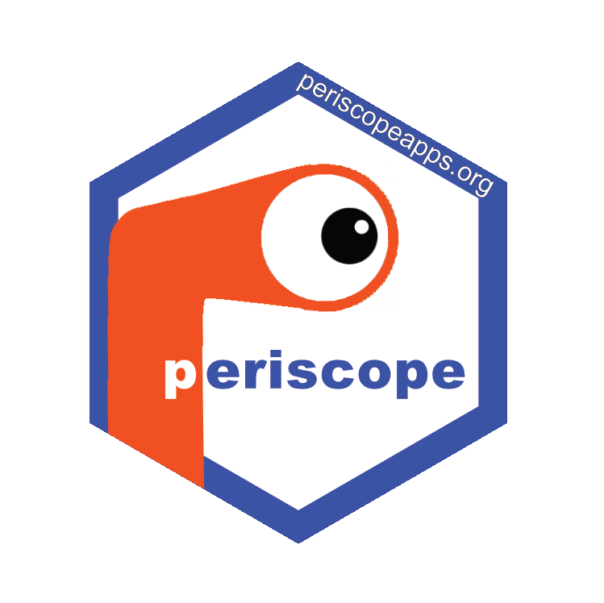

<a href="http://periscopeapps.org:3838"></a>

<!-- Badge Location -->
[](https://cran.r-project.org/package=periscope)
[](https://cran.r-project.org/package=periscope)
[](https://app.circleci.com/pipelines/github/cb4ds/periscope?branch=master)
[](https://codecov.io/github/cb4ds/periscope?branch=master)
<!-- End Badges -->

***periscope*** was originally developed as the core Shiny component for bioinformatics and systems biology analysis applications. It provides a predefined but flexible template for new Shiny applications with a default dashboard layout, three locations for user alerts, a nice busy indicator and logging features. 

One of the most important features of the shiny applications created with this framework is the separation by file of functionality that exists in one of the three shiny scopes: global, server-global, and server-local. The framework forces application developers to consciously consider scoping in Shiny applications by making scoping distinctions very clear without interfering with normal application development. Scoping consideration is important for performance and scaling, which is critical when working with large datasets and/or across many users.  In addition to providing a template application, the framework also contains a number of convenient modules: a (multi)file download button module and a downloadable table module for example.

### Installation

periscope is available for installation from 
[CRAN](https://CRAN.R-project.org/package=periscope) or you can install the
latest version of ***periscope*** from GitHub as follows:

```r
devtools::install_github('cb4ds/periscope')
```

<br/>

---

### Examples

These are included to get you started. You can either start with an empty application or an application that includes samples of the components that you can use within your application.  There is extensive package documentation and full Vignettes are also available to help you with all the options.

<br/>

#### Empty application

```r
library(periscope)
create_new_application('emptyapp', location = tempdir())
runApp('emptyapp')
```


#### Sample application - no right sidebar

```r
library(periscope)
create_new_application("sampleapp1", location = tempdir(), sampleapp = TRUE)
runApp('sampleapp1')

```

#### Sample application - including a right sidebar

```r
library(periscope)
create_new_application("sampleapp2", location = tempdir(), sampleapp = TRUE, rightsidebar = TRUE)
runApp('sampleapp2')

```
