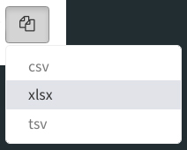

# Overview

## Purpose 

This *Shiny Module* was created in order to provide a consistent-looking and
easy-to-use button that facilitates one or multiple types of file downloads.

## Features

* Auto-adjusts the button image and styling for single or multiple downloads
* Ability to link different data sets to different file types if desired
* Incorporates tooltips and drop-downs automatically
* Converts data to various download types.
* Requires minimal code (see the Usage section for details)

<br>

# Usage

## Shiny Module Overview

Shiny modules consist of a pair of functions that modularize, or package, a 
small piece of reusable functionality.  The UI function is called directly by
the user to place the UI in the correct location (as with other shiny UI
objects). The module server function that is called only once to set it up using the
module name as a function inside the server function (i.e. user-local session
scope.  The function first arguments is string represents the module id (the same id used in module UI function). Additional arguments can be supplied by the user based on the specific shiny module that is called.  There can be additional helper functions that are a part of a shiny module.

The **downloadFile** Shiny Module is a part of the *periscope* package and 
consists of the following functions:

* **downloadFileButton** - the UI function to place the button in the 
application.
* **downloadFile** - the server function to be called inside server_local.R.
* **downloadFile_ValidateTypes** - a helper function that will check a given 
list of file types and warn the caller if the list contains an invalid or 
unsupported type.
* **downloadFile_AvailableTypes** - a helper function that will return a vector 
of supported file types.

## downloadFileButton

The **downloadFileButton** function is called from the ui.R (or equivalent) file 
in the location where the button should be placed.  This is similar to other UI
element placement in shiny.

The downloadFileButton function takes the unique object ID for the UI object
as well as a list of file types the button will allow the user to request and
the tooltip text.

If only one type is given the button will be a single-download type of button
that starts the specified download when the button is pressed.  The button will 
look like:

<center></center>


If more than one type is given there will be a dropdown choice given to the user
when the button is pressed and the download will start when the choose one of 
the types.  The dropdown choices will be in the order given by the call to the
function.  The button and dropdown will look like:

<center>


</center>


```{r, eval=F}
# Inside ui_body.R or ui_sidebar.R

#single download type
downloadFileButton("object_id1", 
                   downloadtypes = c("csv"), 
                   hovertext = "Button 1 Tooltip")

#multiple download types
downloadFileButton("object_id2", 
                   downloadtypes = c("csv", "tsv"), 
                   hovertext = "Button 2 Tooltip")
```

## downloadFile

The **downloadFile** function is called directly. The call consists of the following:

* the unique object ID that was provided to downloadFileButton when creating 
the UI object
* the logging logger to be used
* the root of the downloaded file name to be used in the browser as a character
string or reactive expression that returns a character string
* a **named list** of functions that provide the data (see below).  It is 
important that the types of files to be downloaded are matched to the correct
data function in the list.  The data functions are unquoted function names.  The
functions will be called at the time the user initiates a download 
*(see requirements below)*.
* the aspect ratio is an optional, numeric argument that only applies to supported image types.  
The values are width:height (width/height which is unitless) for example for a 
1:1 ratio (square) the value would be 1/1 = 1, for a 2:1 ratio (wide rectangle)
the value would be 2/1 = 2, for 4:3 ratio (landscape photo) the value would be
4/3 = 1.33, etc.  This value ensures an exported reasonable shape for a plot 
regardless of the size or shape of the application browser window.


**Data Function Requirements**

* The function must require NO parameters.  No parameters will be provided
when the function is called to retrieve the data.
* The function must return an appropriate data format for the file type.  For
instance, for csv/tsv/xlsx types the data returned should be convertible to
a tabular type.
* Since the function is called at the time the user requests the data it is 
acceptable and recommended to use reactive expressions providing dynamic data 
to the user from the application.


```{r, eval = F}
# Inside server_local.R

#single download type
downloadFile("object_id1", 
             logger = ss_userAction.Log,
             filenameroot = "mydownload1",
             datafxns = list(csv = mydatafxn1),
             aspectratio = 1)

#multiple download types
downloadFile("object_id2",
             logger = ss_userAction.Log,
             filenameroot = "mytype2",
             datafxns = list(csv = mydatafxn1, xlsx = mydatafxn2),
             aspectratio = 1)
```


## Sample Application

For a complete running shiny example application using the downloadableTable
module you can create and run a *periscope* sample application using:

```{r, eval=F}
library(periscope)

app_dir = tempdir()
create_new_application('mysampleapp', location = app_dir, sampleapp = TRUE)
runApp(paste(app_dir, 'mysampleapp', sep = .Platform$file.sep))
```

<br>

# Additional Resources


**Vignettes**

* [New Application](new-application.html)
* [downloadableTable Module](downloadableTable-module.html)
* [downloadablePlot Module](downloadablePlot-module.html)

