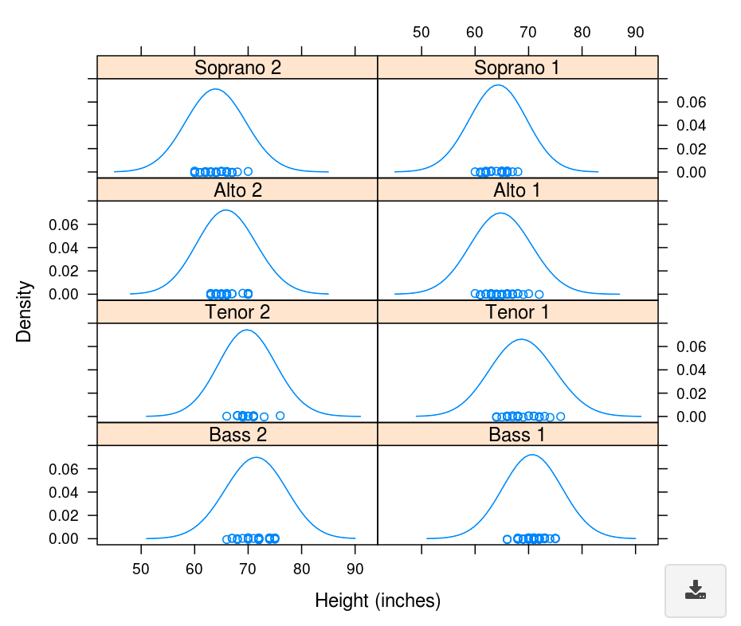

# Overview

## Purpose 

This *Shiny Module* was created in order to provide an
easy-to-use downloadFileButton for a plot that is automatically created, linked 
and managed.  This module is compatible with ggplot2, grob and lattice
produced graphics as well as any superclass of these.

## Features

* Supports ggplot2, grob and lattice graphics and superclasses for maximum flexibility
* Uses the downloadFile Shiny Module functionality to ensure consistent
download functionality and paradigm for image or table data.
* Ability to link different plot downloads from the displayed plot if 
desired *(for example this might be used to ensure a watermark/copyright
notice on downloaded plots)*
* Ability to add data downloads in addition to image downloads using the same
button
* Supports hover/click/brush functionality
* Configurable plot size in application
* Configurable plot aspect ratio for exported images
* Configurable button placement at the bottom of the plot
* Requires minimal code (see the Usage section for details)

<br>

# Usage

## Shiny Module Overview

Shiny modules consist of a pair of functions that modularize, or package, a 
small piece of reusable functionality.  The UI function is called directly by
the user to place the UI in the correct location (as with other shiny UI
objects). The module server function that is called only once to set it up using the
module name as a function inside the server function (i.e. user-local session
scope.  The function first arguments is string represents the module id (the same id used in module UI function). Additional arguments can be supplied by the user based on the specific shiny module that is called.  There can be additional helper functions that are a part of a shiny module.


## downloadablePlotUI

The **downloadablePlotUI** function is called from the ui.R (or equivalent) 
file in the location where the plot should be placed.  This is similar to other
UI element placement in shiny.

The downloadablePlotUI looks like:

<center></center>

The downloadablePlotUI function takes the unique object ID for the UI object.
The next two arguments (downloadtypes and download_hovertext) are passed to the
downloadFileButton and set the file types the button will allow the user to
request and the downloadFileButton's tooltip text.  The next two options (width, 
height) set the plot size in the UI and can be any css-recognizable size value.
These options are followed with alignment and overlap options. The last three 
options give you the standard ways of interacting with shiny plots - using the
functionality available with the clickOpts, hoverOpts and brushOpts functions. 
When you create an object using any of these functions shiny will send 
information about the user's interactions with the plot to the server and make 
it available to you via an input$ variable.


```{r, eval=F}
# Inside ui_body.R or ui_sidebar.R

downloadablePlotUI("object_id1", 
                   downloadtypes = c("png", "csv"), 
                   download_hovertext = "Download the plot and data here!",
                   height = "500px", 
                   btn_halign = "left")
```


## downloadablePlot

The **downloadablePlot** function is also called directly. The call consists of the following:

* the unique object ID that was provided to downloadablePlotUI when creating 
the UI object
* the logging logger to be used
* the root of the downloaded file name to be used in the browser as a character
string or a reactive expression that returns a character string
* the aspect ratio as a numeric value for exported images of supported types.  
The values are width:height (width/height which is unitless) for example for a 
1:1 ratio (square) the value would be 1/1 = 1, for a 2:1 ratio (wide rectangle)
the value would be 2/1 = 2, for 4:3 ratio (landscape photo) the value would be
4/3 = 1.33, etc.  This value ensures an exported reasonable shape for a plot 
regardless of the size or shape of the application browser window.
* a **named list** of functions that provide the images or data to the 
downloadFileButton (see below).  It is important that the types of files to be 
downloaded are matched to the correct named function in the list.  The functions
are unquoted function names and will be called at the time the user initiates a 
download *(see requirements below)*.
* a function providing the plot output for the visible plot.  It can be the same,
or different, function as that provided to any of the download functions.  This
allows finer control over what the user can view vs. download if desired.


**Download Function Requirements**

* The function must require NO parameters.  No parameters will be provided
when the function is called to retrieve the plot or data.
* The function must return an appropriate data format for the file type.  For
instance: csv/tsv/xlsx types require data that is convertible to a tabular type,
tiff requires a tiff class object, etc.  For more information on conversion of data 
to various download types see the downloadFile module help or vignette. 
*Note*: For the visible plot the return value must be from the ggplot2, grob or lattice 
classes (or a superclass)
* Since the function is called at the time the user requests the data it is 
acceptable and recommended to use reactive expressions providing dynamic values 
to the user from the application.  All the above requirements apply.


```{r, eval = F}
# Inside server_local.R

downloadablePlot("object_id1",
                 logger = ss_userAction.Log,
                 filenameroot = "mydownload1",
                 aspectratio = 1.33,
                 downloadfxns = list(png = myplotfxn, tsv = mydatafxn),
                 visibleplot = myplotfxn)
           
```

<br>

# Additional Resources

**Vignettes**

* [New Application](new-application.html)
* [downloadFile Module](downloadFile-module.html)
* [downloadableTable Module](downloadableTable-module.html)
