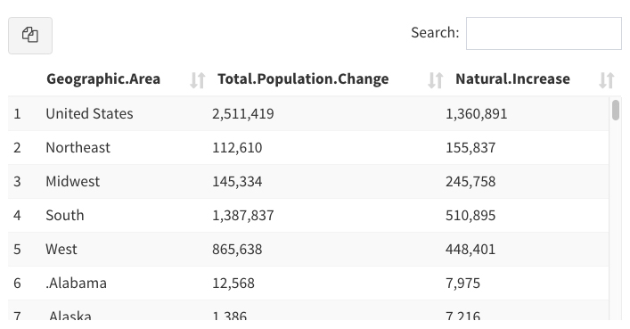
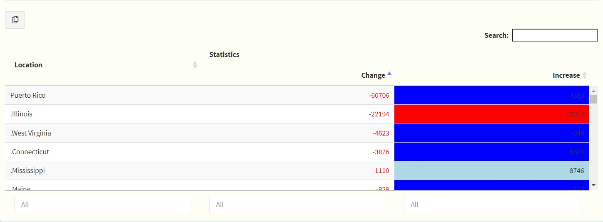

# Overview

## Purpose 

This *Shiny Module* was created in order to provide a consistent-looking and
easy-to-use table including a downloadFileButton that is automatically created,
linked and managed.

## Features

* Uses the downloadFile Shiny Module functionality to ensure consistent
download functionality and paradigm for the table data.
* Ability to link different data sets to the displayed table and downloadFile
functionality if desired 
* User selection of multiple rows by default - can be single select also by 
setting the appropriate option
* Returns a reactive expression containing the rows of the table selected by
the user
* Supports full-table searching including regular expressions with search 
highlighting
* Columns are sortable in both directions
* Configurable table "window" (viewing area) height with infinite vertical 
scrolling (no paging)
* Supports rownames and a table caption
* Requires minimal code (see the Usage section for details)

<br>

# Usage

## Shiny Module Overview

Shiny modules consist of a pair of functions that modularize, or package, a 
small piece of reusable functionality.  The UI function is called directly by
the user to place the UI in the correct location (as with other shiny UI
objects). The module server function that is called only once to set it up using the
module name as a function inside the server function (i.e. user-local session
scope.  The function first arguments is string represents the module id (the same id used in module UI function). Additional arguments can be supplied by the user based on the specific shiny module that is called.  There can be additional helper functions that are a part of a shiny module.

The **downloadableTable** Shiny Module is a part of the *periscope* package and 
consists of the following functions:

* **downloadableTableUI** - the UI function to place the table in the 
application
* **downloadableTable** - the server function to be called inside server_local.R.


## downloadableTableUI

The **downloadableTableUI** function is called from the ui.R (or equivalent) 
file in the location where the table should be placed.  This is similar to other
UI element placement in shiny.

The downloadableTableUI looks like:

<center></center>

The downloadableTableUI function takes the unique object ID for the UI object.
The next two arguments (downloadtypes and hovertext) are passed to the
downloadFileButton and set the file types the button will allow the user to
request and the downloadFileButton's tooltip text.  The contentHeight argument
is optional but important - it sets the viewable height of the table content
which can be any css-recognizable size value.

downloadableTables are multi-select by default, however if you need a table
to only allow single row selections you can set the singleSelect argument
to TRUE.


```{r, eval=F}
# Inside ui_body.R or ui_sidebar.R

downloadableTableUI("object_id1", 
                    downloadtypes = c("csv", "tsv"), 
                    hovertext = "Download the data here!",
                    contentHeight = "300px",
                    singleSelect = FALSE)
```

## downloadableTable

The **downloadableTable** function is called directly. The call consists of the following:

* the unique object ID that was provided to downloadableTableUI when creating 
the UI object
* the logging logger to be used
* the root of the downloaded file name to be used in the browser as a character
string or a reactive expression that returns a character string
* a **named list** of functions that provide the data to the downloadFileButton 
(see below).  It is important that the types of files to be downloaded are
matched to the correct data function in the list.  The data functions are 
unquoted function names.  The functions will be called at the time the user 
initiates a download *(see requirements below)*.
* a data function providing the data for the visible table.  It can be the same,
or different, data as that provided by the download data functions.  This
allows finer control over what the user can view vs. download if desired.
* ... free parameters **named list** to pass table customization options. 
It supports most of DT table options customization. See example below.


**Data Function Requirements**

* The function must require NO parameters.  No parameters will be provided
when the function is called to retrieve the data.
* The function must return an appropriate data format for the file type.  For
instance, for csv/tsv/xlsx types the data returned should be convertible to
a tabular type.  *Note*: For data shown in the table the data must be able to
be converted to tabular format.
* Since the function is called at the time the user requests the data it is 
acceptable and recommended to use reactive expressions providing dynamic data 
to the user from the application.  All the above requirements apply.


**Reactive Return Value**

The server function returns a reactive expression containing the selected
rows (data, not references, rownumbers, etc - the actual table row data).  This
allows the user to capture this to update another table, chart, etc. as desired.
It is acceptable to ignore the return value as well if this functionality is not
needed.

**Customization Options**

*downloadableTable* module can be customized using the same `?DT::datatable` arguments. options or format functions. These options can be sent as a named options via the server function, see example below. 
*Notes*: 

* `selection` parameter in the server function has different usage than `DT::datatable` `selection` option as it should be a function or reactive expression providing the row_ids of the rows that should be selected. Its default value is `NULL`
* `editable`, `width`, `height` options in `DT::datatable` are not supported

The following is an example of a customized downloadableTable:

<center></center>

It is generated using the following code:

```{r, eval = F}
# Inside server_local.R
sketch <- htmltools::withTags(table(
    class = "display",
    thead(
        tr(
            th(rowspan = 2, "Location"),
            th(colspan = 2, "Statistics")
        ),
        tr(
            th("Change"),
            th("Increase")
        )
        
    )
))

selectedrows <- downloadableTable("exampleDT1",
                                  ss_userAction.Log,
                                  "exampletable",
                                  list(csv = load_data3, tsv = load_data3),
                                  load_data3,
                                  colnames = c("Area", "Delta", "Increase"),
                                  filter = "bottom",
                                  callback = htmlwidgets::JS("table.order([1, 'asc']).draw();"),
                                  container = sketch,
                                  formatStyle = list(columns = c("Total.Population.Change"),   
                                                     color = DT::styleInterval(0, c("red", "green"))),
                                  formatStyle = list(columns = c("Natural.Increase"),   
                                                     backgroundColor = DT::styleInterval(
                                                         c(7614, 15914, 34152),
                                                         c("blue", "lightblue", "#FF7F7F", "red"))))

# NOTE: selectedrows is the reactive return value, captured for later use
```


## Sample Application

For a complete running shiny example application using the downloadableTable
module you can create and run a *periscope* sample application using:

```{r, eval=F}
library(periscope)

app_dir = tempdir()
create_new_application('mysampleapp', location = app_dir, sampleapp = TRUE)
runApp(paste(app_dir, 'mysampleapp', sep = .Platform$file.sep))
```

<br>

# Additional Resources


**Vignettes**

* [New Application](new-application.html)
* [downloadFile Module](downloadFile-module.html)
* [downloadablePlot Module](downloadablePlot-module.html)

