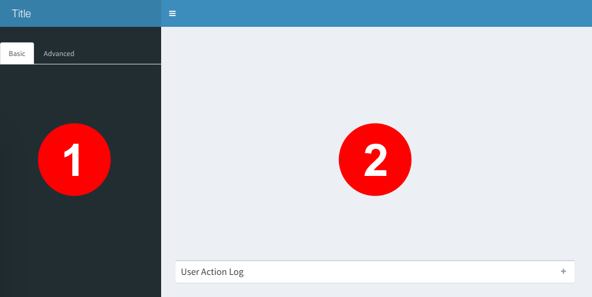
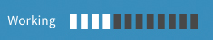
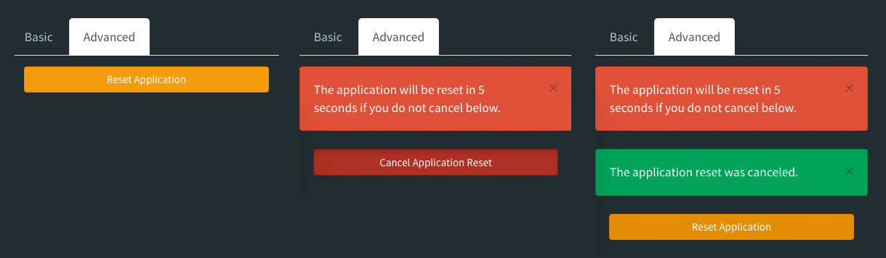
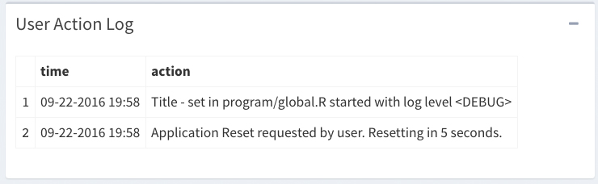
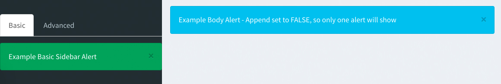
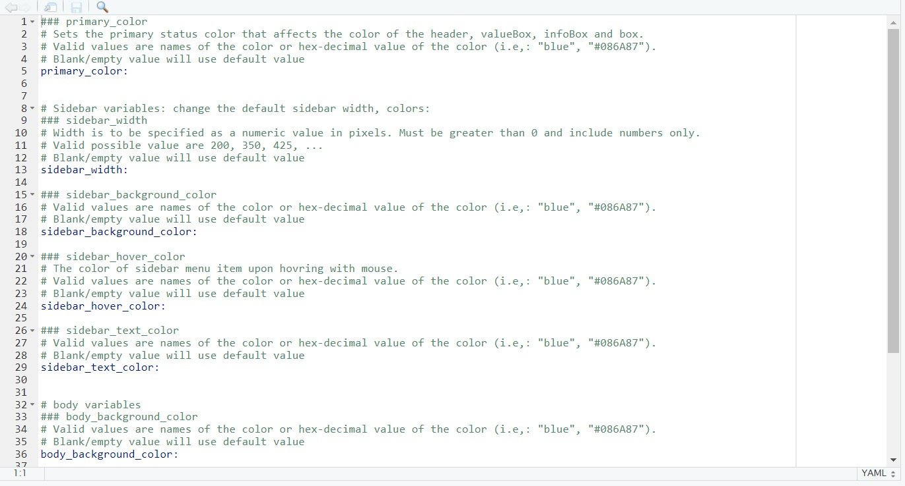
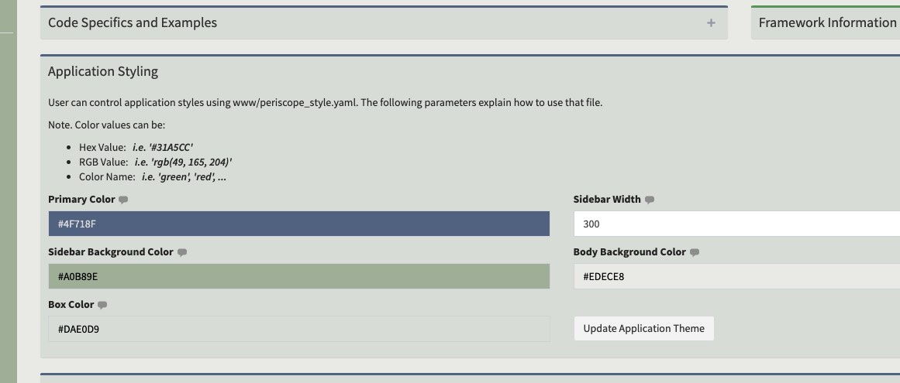

# Overview

## Purpose

This framework was created for the express purpose of making it easy for shiny
developers to create consistent-looking and functioning applications.  This is
important because it reduces the time a user must spend to learn the interface
for new applications (this reducing application support time and increasing 
the user's satisfaction across applications).

In addition to creating a consistent UI experience this framework reduces
development time for new applications by removing some of the boilerplate
aspects of new applications such as alerting, logging, etc.

<br>

## UI Sections

<center></center>

*1: Left Sidebar*

The left sidebar is reserved for configuration options, settings, and general user
application controls and functionality that will affect the body of the
application.  

There are two tabs in the sidebar **Basic** and **Advanced**.  The *Basic* tab
is intended to be used for commonly accessed options and settings whereas the 
*Advanced* tab is reserved for less-common options and settings.  The tab 
names (or labels) can be changed. Both tabs are optional and if one of them or both 
are missing there will be no tabs shown (the sidebar will not have tabbed areas).

The left sidebar can be collapsed in desktop mode to maximize the user's view of the
application body when they do not immediately need the configuration options and
settings. Also, it is possible to create an application without a left sidebar.

*2: Body*

This is the main body area for applications where charts and figures, tables, 
etc. are placed by the application developer.  If desired the developer can
add tabbed pages, etc.

*3: Right Sidebar*

The right sidebar is, like the left sidebar, reserved for configuration options, settings, 
and general user application controls and functionality that will affect the body of the
application.  
Users can create their own tabs in the right sidebar up to a maximum of 5.

The right sidebar is collapsed by default, it can be opened by clicking on the (customizable) icon.

<br>
**Note:** The blue area running across the top of the application is the header bar. This
area is reserved for framework use.

<br>

## Features

### New Application Template Generation

* **Empty application** - ready for the user to drop in their code!
* **Sample application** - demonstrates framework features in a working application


### Built-in Conveniences

#### Responsive UI

The application layout will adapt to user device size automatically

#### Application Busy Indicator

This indicator shows in the header bar automatically when the shiny application
is busy.  There is no application developer code necessary to tie into this 
functionality.

<center></center>

#### Application Reset

There is a button placed by the framework at the bottom of the Advanced sidebar 
tab.  This button is automatically wired to reset the application to the initial
session state.  The user is given a warning (as an alert on the Advanced tab)
and the reset is delayed (default = 5s) to allow the user to cancel the reset. 
Reset requests and cancellations are logged automatically.

<center></center>

#### Logging & Log Display

The framework makes it easy to log user actions.  Framework user interactions
are automatically logged.  The user interaction log is automatically shown in 
a (collapsed) box at the bottom of the application body but can be turned off
by setting userlog = FALSE in *set_app_parameters* in *program/global.R*.

<center></center>

```{r, eval=F}
# Add a user action to the log
loginfo("Your Information Message with %s, %s parameters", parm1, parm2, logger = ss_userAction.Log)

logwarn("Your Warning Message!", logger = ss_userAction.Log)
```


#### Alerting

There are four standardized locations for user-alerts: the top of the basic
sidebar tab, the top of the advanced sidebar tab, the top of the body and at 
the top of the right sidebar.
All the alerts are dismissible by the user and can be colored by setting the
status.

Alerts can accumulate (i.e. append to each other) or replace previous alerts. 

<center></center>


```{r, eval=F}
# Alert on Sidebar>Basic tab
createAlert(session, "sidebarBasicAlert", 
            style = "info", 
            content = "Basic Alert Text")
# Alert on Sidebar>Advanced tab
createAlert(session, "sidebarAdvancedAlert", 
            style = "danger", 
            content = "Advanced Alert Text")
# Alert in the Body Area
createAlert(session, "bodyAlert", style = "success",
            content = "Body Alert Text", append = FALSE)
# Alert on Right Sidebar
createAlert(session, "sidebarRightAlert", 
            style = "error", 
            content = "Error Alert Text")
```

#### Styling
##### Overview
Different parts of the generated application can be customized with a custom yaml file called *periscope_style.yaml* located under *www* folder as follow:

<center></center>

##### Usage

* User can update the values for **periscope_style.yaml** then restart the application so new changes can take affect.
* User can pass an existing **periscope_style.yaml** from an existing app to new one through passing its location to `custom_theme_file` parameter in `create_new_application` method.
* The sample applications contain a section to explore updating some styles interactively:

<center></center>

* The generated yaml file for blank applications will contain no values for the properties -- blank application will use default style options unless they are customized.

*See the Creating a Sample Application and Creating your Application sections for an example* 

### Shiny Modules

#### downloadFile

This is a high-functionality set of custom-styled buttons with the built-in 
ability to download data in different file formats.

*See the downloadFileButton Vignette for more detailed information*

#### downloadableTable

This is a high-functionality custom styled table that includes a 
downloadFileButton linked to the data.

*See the downloadableTable Vignette for more detailed information*

#### downloadablePlot

This is a custom plot output that is paired with a linked downloadFile button 
which allows the user to download the plot in different file formats.

*See the downloadablePlot Vignette for more detailed information*

<br>

# Creating a Sample Application

## Step 1: Generate

```{r, eval=F}
library(periscope)

app_dir = tempdir()
create_new_application(name = 'mytestapp', location = app_dir, sampleapp = TRUE)
# application without a left sidebar
create_new_application(name = 'mytestapp', location = app_dir, sampleapp = TRUE, leftsidebar = FALSE)
# application without a reset button
create_new_application(name = 'mytestapp', location = app_dir, sampleapp = TRUE, resetbutton = FALSE)
# application with a right sidebar using the default icon
create_new_application(name = 'mytestapp', location = app_dir, sampleapp = TRUE, rightsidebar = TRUE)
# application with a right sidebar using a custom icon
create_new_application(name = 'mytestapp', location = app_dir, sampleapp = TRUE, rightsidebar = "table")
# application with a custom style file
create_new_application(name = 'mytestapp', location = app_dir, sampleapp = TRUE, custom_theme_file = "periscope_style.yaml")
```

This generates a default sample application optionally with a left/right sidebar in a subdirectory named *mytestapp* 
at the specified location.  The location must exist when calling this function.

*Note*: If the *mytestapp* directory in this location already exists it will not 
be overwritten - the function will give a warning and exit without modifying the 
user's system.

## Step 2: Run

```{r, eval=F}
runApp(paste(app_dir, 'mytestapp', sep = .Platform$file.sep))

```

The application should run in either the viewer or browser (depending on system
preferences/settings).  It will contain help text, test buttons, a sample log,
etc.  You can use this sample application to explore the functionality and code!

<br>

# Creating your Application

## Step 1: Generate a Blank Application

```{r, eval=F}
library(periscope)

app_dir = tempdir()
create_new_application(name = 'mytestapp', location = app_dir)
# application without a left sidebar
create_new_application(name = 'mytestapp', location = app_dir, leftsidebar = FALSE)
# application without a reset button
create_new_application(name = 'mytestapp', location = app_dir, resetbutton = FALSE)
# application with a right sidebar using the default icon
create_new_application(name = 'mytestapp', location = app_dir, rightsidebar = TRUE)
# application with a right sidebar using a custom icon
create_new_application(name = 'mytestapp', location = app_dir, rightsidebar = "table")
# application with a custom style file
create_new_application(name = 'mytestapp', location = app_dir, custom_theme_file = "periscope_style.yaml")
```

This generates a default blank application optionally with a left/right sidebar in a subdirectory named *mytestapp* 
at the specified location.  The location must exist when calling this function.

*Note*: If the *mytestapp* directory in this location already exists it will not
be overwritten - the function will give a warning and exit without modifying the 
user's system.

## Step 2: Run (optional)

```{r, eval=F}
runApp('mytestapp', appDir = app_dir)
```

It is recommended to run the empty application after creation to ensure a
proper setup before beginning to customize the application.

## Step 3: Customize

All user customization is done in the files in the **program** subdirectory.
We'll walk through a few examples of how to add components and functionality 
as in a typical shiny application but using this framework.

### program/global.R

Set your application title, application version, titleinfo, change the loglevel and optionally turn
off the userlog using *set_app_parameters()*.

The *app_version* parameter in this function has a default value of "1.0.0". It is recommended to follow the best practice in R's packaging versioning. This means that a version consists of 3 numbers, *&lt;major&gt;.&lt;minor&gt;.&lt;patch&gt;*.

The *titleinfo* parameter in this function can be:

* NULL - The application title will be plain text with no extra functionality
* URL (character string) - The application title will be a clickable link that
will send the user to an external URL location.  Any html-valid url can be used
to link to an accessible file location, http location, mailto: functionality or
javascript.
* HTML value - The html will be placed into a pop-up modal window that will be
shown when the user clicks the title link.  Create the value using the
shiny::HTML() function.

***Important:*** Any variables or functions placed into this file are globally
scoped and will be available to ui and server functions across all user
sessions.

```{r, eval=F}
# Plain text title
set_app_parameters(title = "My Application Title")

# Application Title links to an external url
set_app_parameters(title = "My Application Title",
                   titleinfo = "http://www.somelocation.com")

# Application Title links to a modal window with HTML content
set_app_parameters(title = "My Application Title",
                   titleinfo = HTML("<h3>This is information about this application</h3>",
                                    "<p><b>Author: </b>Me</p>",
                                    "<p><b>Date: </b>", Sys.Date(), "</p>"))
```

### program/ui_sidebar.R  

Create UI components for the left sidebar and register them with the framework using
a call to *add_ui_sidebar_basic()* or *add_ui_sidebar_advanced()* according to
which tab they should appear on in the sidebar.  

If *add_ui_sidebar_advanced()* is not called there will be no second tab in the 
sidebar and the tabs will not be shown.

```{r, eval=F}
# -- Create UI sidebar Elements
s1 <- div( helpText(align = "center", "Sample UI Text"),
                  selectInput("sample1", "A Select", c("A", "B", "C")) )

s2 <- div( ui_tooltip("sample2_tt", "Pick An Option", "Popup Text"),
                  radioButtons("sample2", NULL, c("A", "B", "C")) )
                  
# -- Register Basic Elements in the ORDER SHOWN in the UI
add_ui_sidebar_basic(list(s1, s2), append = FALSE)

# -- Change the Label of the Basic Tab
add_ui_sidebar_basic(list(s1, s2), append = FALSE, tabname = "Options")
```

### program/ui_sidebar_right.R  

Create UI components for the right sidebar and register them with the framework using
a call to *add_ui_sidebar_right()*.  

```{r, eval=F}
# -- Create UI sidebar Elements
s1 <- rightSidebarTabContent(id = 1, 
                             icon = "desktop", 
                             title = "Tab 1", 
                             active = TRUE, 
                             div(helpText(align = "center", 
                                          "Sample UI Text"),
                                 selectInput("sample1", 
                                             "A Select", 
                                             c("A", "B", "C"))))
                  
# -- Register Basic Elements in the ORDER SHOWN in the UI
add_ui_sidebar_right(list(s1), append = FALSE)
```

### program/ui_body.R

Create UI components for the body and register them with the framework using a
call to *add_ui_body()*.  Use box elements for consistent presentation of your
UI sections.  Remember that there are 12 "blocks" across in the body.

```{r, eval=F}
body1 <- box( id     = "bodyElement1",
              title  = "Box 1",
              width  = 8,          #2/3 of the width
              status = "primary",  #colored bar at the top
              collapsible = TRUE,
              collapsed   = FALSE,
              htmlOutput("example1") )

body2 <- box( id     = "bodyElement2",
              title  = "Box 2",
              width  = 4,          #1/3 of the width
              status = "danger",   #colored bar at the top
              collapsible = FALSE,
              p("Some great text in paragraph format"),
              pre("A pre-formatted (e.g. code) block"),
              actionButton("exButton", label = "Example") )

add_ui_body(list(body1, body2))
```

In the above example UI elements are being added in 2 different ways.  *body1* 
uses an htmlOutput element to set a placeholder for the id "example1" which will 
be setup in the server file.  This is commonly used when there is need for a
dynamic UI element that cannot be setup ahead of the session (for example it is 
dependent on data at runtime).  *body2* defines the UI elements in place here. 

This illustrates the two most common paradigms for creating shiny UI elements. 
For more information see the Shiny documentation.


### program/server_local.R

Create your application functionality in this file.  This corresponds to the
inside of the *shinyServer(...)* call in a traditional Shiny application and is
where the majority of your application code will reside.  The variables and 
functions in this file are isolated to a single application session.

**Variables Available**

* *input, output, session* - standard Shiny variables
* *ss_userAction.Log* - Reactive Logger object used to add items to the log

You can also call the *get_url_parameters(session)* function to retrieve anything passed
at the end of the URL.


```{r, eval=F}
source("program/fxn/makeplot.R")

#build the deferred UI from ui_body.R
output$example1 <- renderUI({
    list(downloadFileButton("ex_d1", c("csv"), "Download CSV"),
         hr(),
         p("Some great explanatory text in my application"))
    })

downloadFile("ex_d1", ss_userAction.Log, "mydownload", list(csv=get_ref_data))

observeEvent(input$exButton, {
    loginfo("exButton Pressed!", logger = ss_userAction.Log)
    createAlert(session, "bodyAlert",
                style = "success",
                content = "Example Button Pressed!")
})
```

### program/server_global.R

Create variables and functions in this file that are the same for **all** 
sessions and users of your application.  It corresponds to the area above the
*shinyServer(...)* call in a traditional Shiny application and generally there 
will not be a lot of usage of this file because of its global scoping.  However, 
one of the common uses is to load reference data sets that are the same for all
users of the application.  

```{r, eval=F}
ref_data <- read.csv("program/data/mydata.csv")

get_ref_data <- function() {
    return(ref_data)
}
```

### Other

#### program/data (directory)

Use this directory to store data for your application.  Note that a **.gitignore**
file has been added so that data is not accidentally versioned.  If you want
to version files in this directory you will need to modify this file 
accordingly.


#### program/fxn (directory)

Use this directory to store your .R files containing helper functions. Don't
forget to source these files in the appropriate place according to your scoping 
needs.  *(i.e. you would source a file in server_local.R to scope by user 
session, server_global.R to scope across all sessions, and global.R to scope 
across all sessions and UI)*

#### www/periscope_style.yaml

Updated this file values and restart app to customize application different parts styles.

<br>

# Additional Resources

**Application Gallery**

There is a gallery of example applications using the periscope framework at [http://periscopeapps.org](http://periscopeapps.org:3838)


**Vignettes**

* [downloadFile Module](downloadFile-module.html)
* [downloadableTable Module](downloadableTable-module.html)
* [downloadablePlot Module](downloadablePlot-module.html)

